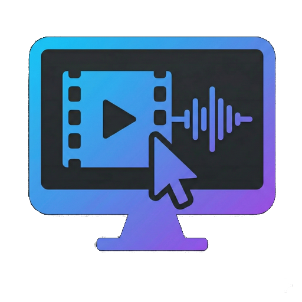

# Clip Studio Desktop

<div align="center">



### Captura instantánea de audio, video y pantalla con un solo atajo de teclado.


[📦 Descargar](#instalacion) • [🚀 Características](#caracteristicas) • [⌨️ Atajos](#atajos) • [📖 Docs](clip-studio-desktop-spec.md)

</div>

---

## 📋 ¿Qué es Clip Studio Desktop?

**Clip Studio Desktop** es una aplicación ligera que se ejecuta en segundo plano y te permite:

- 🎬 **Grabar video** de tu pantalla con un atajo de teclado
- 🎵 **Grabar audio** del sistema y/o micrófono
- 📸 **Tomar capturas** de pantalla completa o de una región seleccionada
- 📋 **Copiar al portapapeles** capturas instantáneas

Todo esto sin interrumpir tu flujo de trabajo. La aplicación vive en la **bandeja del sistema** (junto al reloj) y responde a atajos globales que funcionan incluso cuando otras aplicaciones tienen el foco.

---

## <a id="caracteristicas"></a>🚀 Características

### 🎥 Grabación de Video
- Captura tu pantalla completa en tiempo real
- Audio del sistema incluido automáticamente
- Opción de incluir micrófono
- Conversión automática a formatos estándar

### 🎵 Grabación de Audio
- Captura todo el audio que suena en tu PC
- Graba también tu micrófono (opcional)
- Perfecto para grabar llamadas, música, tutoriales...

### 📸 Capturas de Pantalla
- **Pantalla completa**: Un clic y listo
- **Selección de región**: Dibuja un rectángulo para capturar solo lo que necesitas
- **Al portapapeles**: Pega directamente en cualquier aplicación

### ⚙️ Configuración Flexible
- Elige la carpeta donde guardar tus clips
- Personaliza todos los atajos de teclado
- Configura formatos y calidad de salida
- Activa/desactiva el inicio automático con Windows

---

## 💾 Espacio Reservado (Buffer)

Clip Studio Desktop utiliza un sistema de **espacio reservado en disco** para garantizar que siempre haya espacio disponible para tus grabaciones. 

### ¿Cómo funciona?

1. **Al iniciar**, la aplicación reserva un espacio en tu disco (configurable)
2. **Durante la grabación**, los archivos temporales se almacenan en este espacio
3. **Al finalizar**, el archivo se convierte al formato final y se mueve a tu carpeta de clips
4. **El espacio se libera** automáticamente cuando ya no se necesita

### Capacidad Real

> 📊 **Basado en pruebas reales** con la configuración por defecto:

| Espacio Reservado | Duración Aproximada |
|-------------------|---------------------|
| **5 GB** (por defecto) | **5+ minutos** de video |

*Configuración de prueba: MP4, 1080p, 60 FPS, 15000 kbps*

### Configuración

Puedes ajustar el espacio reservado desde la pestaña **Audio y Video** en la configuración:

- **Mínimo**: 1 GB
- **Por defecto**: 5 GB
- **Máximo**: Sin límite (depende de tu disco)

> 💡 **Tip**: Si grabas sesiones largas, aumenta el espacio reservado. Si tienes poco espacio en disco, puedes reducirlo.

## 🎨 Formatos Soportados

### Audio
| Formato | Descripción |
|---------|-------------|
| **MP3** | Universal, tamaño compacto |
| **FLAC** | Sin pérdida, máxima calidad |
| **WAV** | Sin comprimir |
| **OGG** | Alternativa libre |

### Video
| Formato | Códec |
|---------|-------|
| **MP4** | H.264 + AAC |
| **WebM** | VP9 + Opus |
| **MKV** | H.264 + AAC |

### Imágenes
| Formato | Descripción |
|---------|-------------|
| **PNG** | Sin pérdida, soporta transparencia |
| **JPG** | Comprimido, configurable |

---

## <a id="atajos"></a>⌨️ Atajos de Teclado

> **Nota**: Todos los atajos son personalizables desde la ventana de configuración.

### Atajos por Defecto

| Atajo | Acción |
|-------|--------|
| `Ctrl + Alt + V` | Iniciar/Detener grabación de **video** |
| `Ctrl + Alt + A` | Iniciar/Detener grabación de **audio** |
| `Alt + X` | Captura de pantalla con **selección de región** |
| `Alt + V` | Captura de **pantalla completa** |
| `Alt + C` | Captura de selección **al portapapeles** |

### ¿Cómo funcionan?

1. **Presiona el atajo** → La grabación comienza (o se toma la captura)
2. **Trabaja normalmente** → La app graba en segundo plano
3. **Presiona de nuevo** → La grabación se detiene y se guarda automáticamente
4. **Notificación** → Recibes una notificación con la ubicación del archivo

---

## <a id="instalacion"></a>📦 Instalación

### Opción 1: Instalar la aplicación (Recomendado)

1. Ve a la sección [Releases](https://github.com/TuUsuario/ClipStudioDesktop/releases)
2. Descarga el archivo `ClipStudioDesktop_Setup.msi`
3. Ejecuta el archivo descargado y sigue las instrucciones del instalador
4. Una vez instalado, busca "Clip Studio Desktop" en el menú inicio

> 💡 **Nota**: La aplicación se configura para iniciarse automáticamente con Windows, pero puedes cambiar esto en la configuración.

### Opción 2: Compilar desde el código fuente

Requiere [.NET 8.0 SDK](https://dotnet.microsoft.com/download/dotnet/8.0).

```powershell
# Clonar el repositorio
git clone https://github.com/TuUsuario/ClipStudioDesktop.git
cd ClipStudioDesktop

# Compilar en modo Release
dotnet publish src/ClipStudioDesktop/ClipStudioDesktop.csproj -c Release -o ./publish

# Ejecutar
./publish/ClipStudioDesktop.exe
```

---

## 🖥️ Uso

### Primera vez

1. **Ejecuta la aplicación** → Aparecerá un icono en la bandeja del sistema (junto al reloj)
2. **Haz doble clic** en el icono → Se abre la ventana de configuración
3. **Configura tus preferencias** → Carpetas, formatos, atajos...
4. **Cierra la ventana** → La app seguirá en segundo plano

### Día a día

```
┌─────────────────────────────────────────────────────────┐
│                                                         │
│   Ctrl+Alt+V  →  🔴 Grabando video...                  │
│                                                         │
│   (trabajas normalmente)                                │
│                                                         │
│   Ctrl+Alt+V  →  ✅ Video guardado en Clips/Videos/    │
│                                                         │
└─────────────────────────────────────────────────────────┘
```

### Menú del icono (clic derecho)

| Opción | Descripción |
|--------|-------------|
| 🎬 Grabar Video | Inicia/detiene grabación de video |
| 🎵 Grabar Audio | Inicia/detiene grabación de audio |
| 📁 Abrir Clips | Abre la carpeta donde se guardan los archivos |
| ⚙️ Configuración | Abre la ventana de ajustes |
| ❌ Salir | Cierra la aplicación |

---

## 📁 Ubicación de Archivos

Por defecto, la app guarda los archivos en:

| Tipo | Carpeta |
|------|---------|
| Videos | `%USERPROFILE%\Videos\ClipStudio\` |
| Audio | `%USERPROFILE%\Music\ClipStudio\` |
| Capturas | `%USERPROFILE%\Pictures\ClipStudio\` |

> Puedes cambiar estas rutas desde la pestaña **General** en la configuración.

---

## ❓ Preguntas Frecuentes

<details>
<summary><b>¿La aplicación consume muchos recursos?</b></summary>

No. Clip Studio Desktop está optimizado para usar mínimos recursos cuando no está grabando. Durante la grabación, el uso de CPU depende de la resolución de tu pantalla y el FPS configurado.
</details>

<details>
<summary><b>¿Se inicia automáticamente con Windows?</b></summary>

Puedes activar o desactivar esta opción desde la pestaña **General** → "Iniciar con Windows".
</details>

<details>
<summary><b>¿Puedo grabar solo una ventana?</b></summary>

Actualmente la grabación de video captura la pantalla completa. Para capturas de pantalla, puedes usar la selección de región (Alt+X).
</details>

<details>
<summary><b>¿Cómo cambio los atajos de teclado?</b></summary>

1. Abre la configuración (doble clic en el icono)
2. Ve a la pestaña **Atajos**
3. Haz clic en el campo del atajo que quieres cambiar
4. Presiona la nueva combinación de teclas
5. Guarda los cambios
</details>

<details>
<summary><b>¿Funciona con múltiples monitores?</b></summary>

Sí, la grabación de video captura el monitor principal. Las capturas de pantalla pueden capturar cualquier monitor.
</details>

---

## 🛠️ Para Desarrolladores

Si quieres contribuir o entender cómo funciona internamente la aplicación, consulta la **documentación técnica**:

📄 **[clip-studio-desktop-spec.md](clip-studio-desktop-spec.md)**

Incluye:
- Arquitectura del proyecto (MVVM)
- Diagramas de flujo y estados
- Estructura de archivos
- Sistema de servicios
- Guía para agregar nuevas funcionalidades

### Stack Tecnológico

- **.NET 8.0** - Runtime
- **WPF** - Interfaz de usuario
- **NAudio** - Captura de audio (WASAPI)
- **SharpAvi** - Grabación de video
- **FFmpeg** - Conversión de formatos

---

## 📄 Licencia

Este proyecto está bajo la licencia **MIT**. Consulta el archivo [LICENSE](LICENSE) para más detalles.

---

<div align="center">

Hecho con ❤️ para la comunidad

⭐ Si te resulta útil, ¡dale una estrella al repositorio! ⭐

</div>
