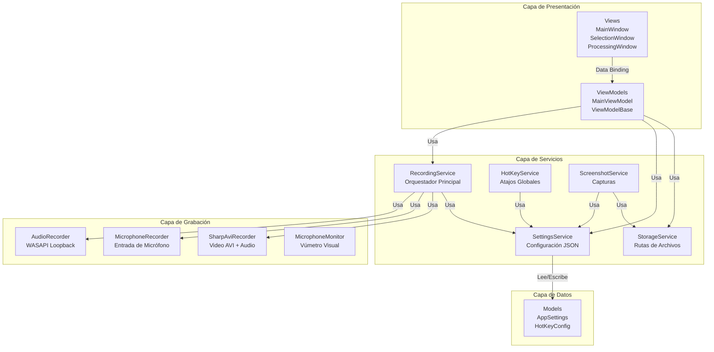
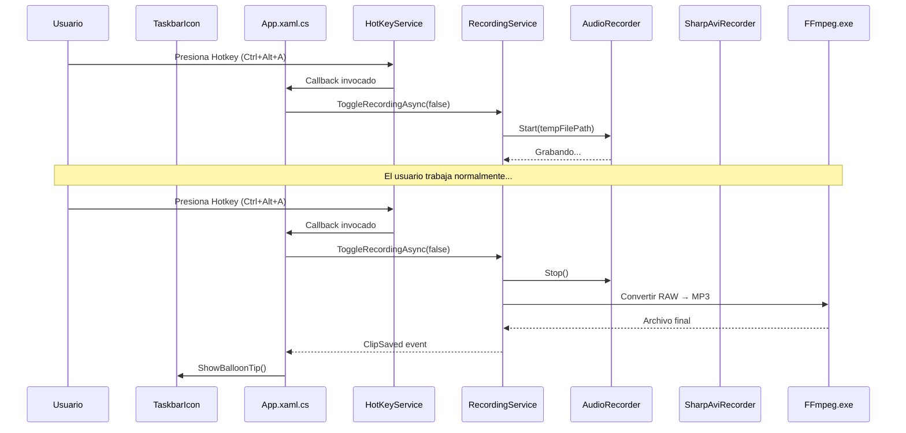
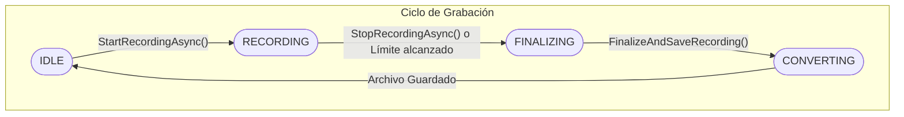
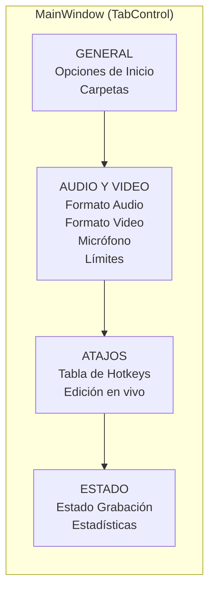
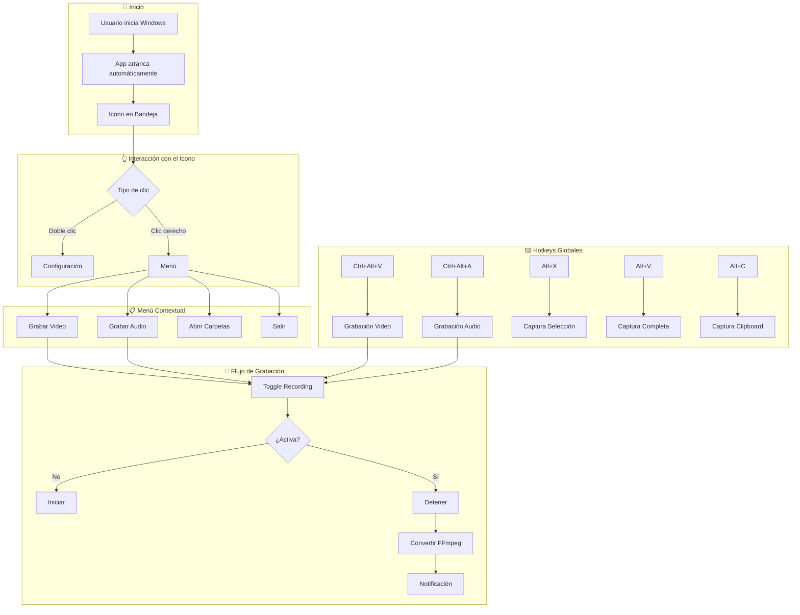
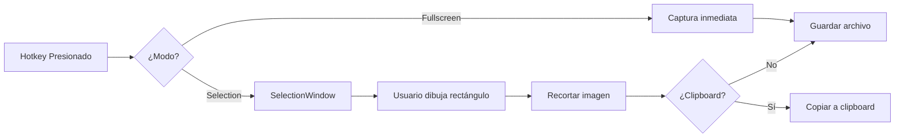
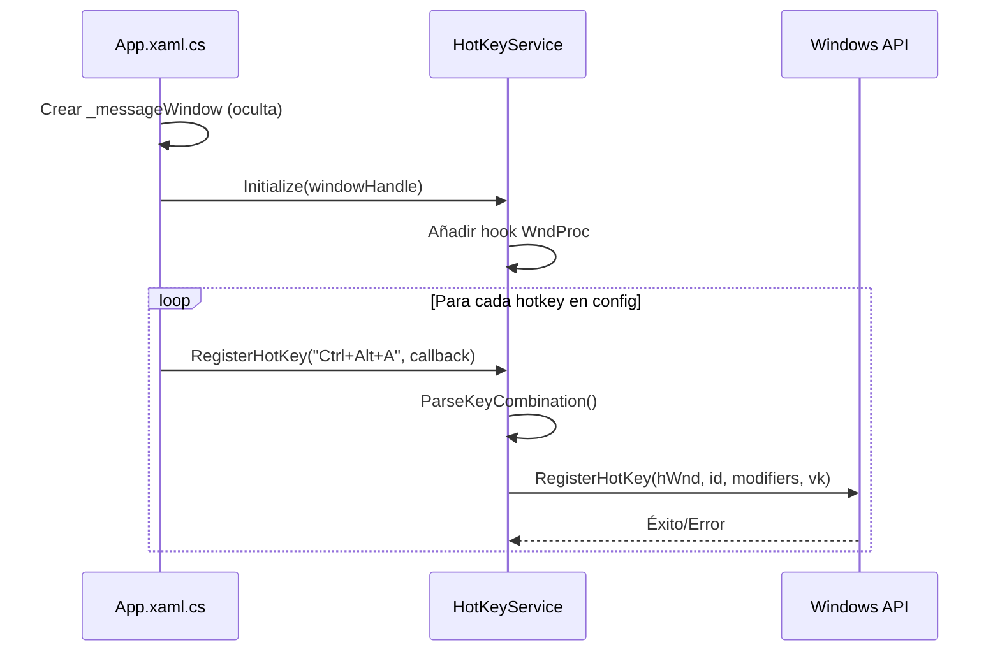
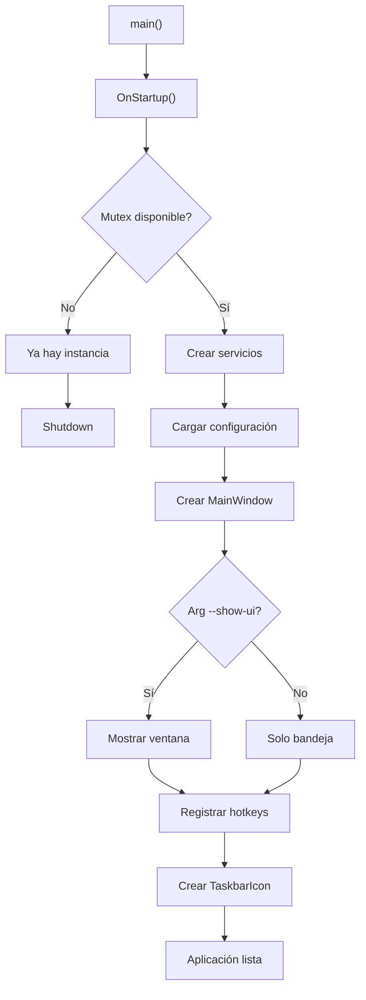
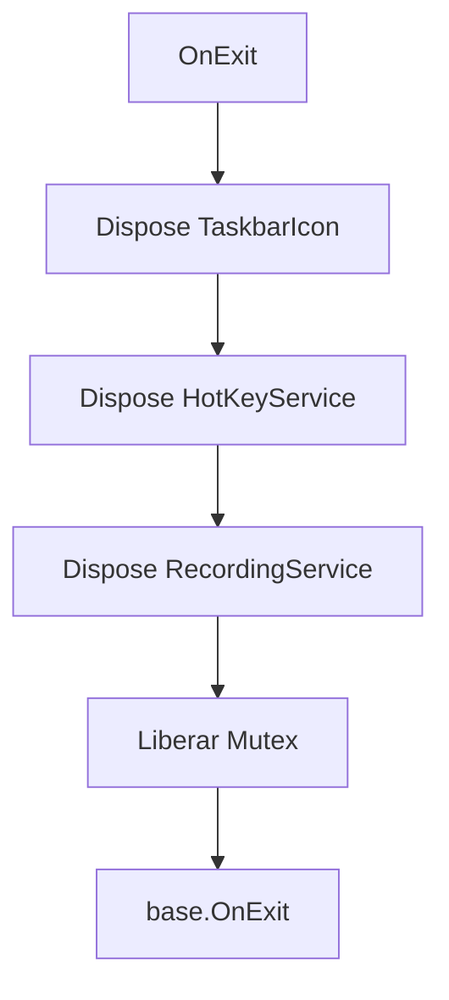
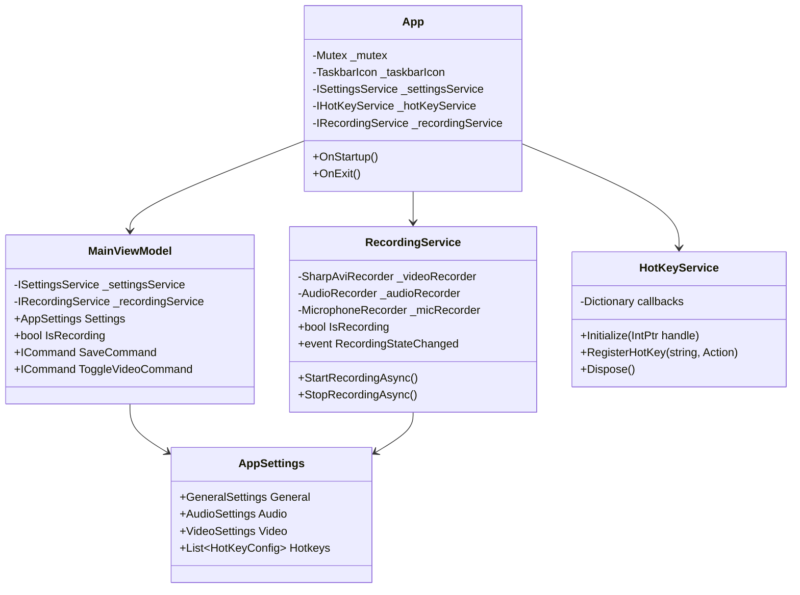

# Clip Studio Desktop - Especificación Técnica

> **Versión:** 1.0.0  
> **Última Actualización:** Enero 2026  
> **Plataforma:** Windows 10/11 (64-bit)

---

## 📋 Índice

1. [Introducción](#1-introducción)
2. [Stack Tecnológico](#2-stack-tecnológico)
3. [Arquitectura del Proyecto](#3-arquitectura-del-proyecto)
4. [Estructura del Proyecto](#4-estructura-del-proyecto)
5. [Componentes Principales](#5-componentes-principales)
6. [Flujo de Navegación](#6-flujo-de-navegación)
7. [Modos de la Aplicación](#7-modos-de-la-aplicación)
8. [Sistema de Servicios](#8-sistema-de-servicios)
9. [Modelo de Datos](#9-modelo-de-datos)
10. [Sistema de Hotkeys](#10-sistema-de-hotkeys)
11. [Diseño Visual](#11-diseño-visual)
12. [Ciclo de Vida de la Aplicación](#12-ciclo-de-vida-de-la-aplicación)
13. [Guía de Desarrollo](#13-guía-de-desarrollo)

---

## 1. Introducción

**Clip Studio Desktop** es una aplicación de escritorio para Windows que permite la captura instantánea de audio, video y capturas de pantalla mediante atajos de teclado globales. La aplicación está diseñada para funcionar en segundo plano con un icono en la bandeja del sistema, permitiendo a los usuarios guardar clips multimedia de manera rápida y eficiente.

### Características Principales

- **Grabación de Audio**: Captura audio del sistema (loopback) y/o micrófono
- **Grabación de Video**: Captura de pantalla completa con audio integrado
- **Capturas de Pantalla**: Pantalla completa, selección de región, o copiar al portapapeles
- **Hotkeys Globales**: Atajos de teclado configurables que funcionan sin foco en la aplicación
- **Icono en Bandeja**: Ejecución en segundo plano con menú contextual completo
- **Conversión Automática**: Procesamiento de archivos raw a formatos estándar (MP4, MP3, PNG, etc.)

---

## 2. Stack Tecnológico

### Framework y Runtime

| Tecnología | Versión | Propósito |
|------------|---------|-----------|
| **.NET** | 8.0 | Runtime principal |
| **WPF** | .NET 8.0-windows | Framework de UI |
| **Windows Forms** | Integrado | Captura de pantalla y notificaciones |
| **C#** | 12 | Lenguaje de programación |

### Dependencias NuGet

| Paquete | Versión | Uso |
|---------|---------|-----|
| `NAudio` | 2.2.1 | Captura y procesamiento de audio (WASAPI Loopback) |
| `SharpAvi` | 3.0.0 | Generación de archivos AVI (Motion JPEG) |
| `OpenCvSharp4.Windows` | 4.11.0 | Procesamiento de imágenes (opcional) |
| `Hardcodet.NotifyIcon.Wpf` | 1.1.0 | Icono de bandeja del sistema |
| `System.Drawing.Common` | 8.0.0 | Manipulación de bitmaps para capturas |

### Herramientas Externas

| Herramienta | Versión | Propósito |
|-------------|---------|-----------|
| **FFmpeg** | Incluido | Conversión de audio/video (RAW → MP4/MP3/WebM) |

---

## 3. Arquitectura del Proyecto

### Patrón de Diseño: MVVM (Model-View-ViewModel)

La aplicación sigue el patrón MVVM con inyección de dependencias manual (sin contenedor IoC).



### Diagrama de Flujo de Comunicación



---

## 4. Estructura del Proyecto

```
ClipStudioDesktop/
├── ClipStudioDesktop.sln           # Solución de Visual Studio
├── README.md                        # Documentación general
├── ffmpeg.exe                       # Herramienta de conversión (incluida)
├── build_release.ps1                # Script de compilación release
├── build_installer.ps1              # Script de generación de instalador
│
├── installer/                       # Archivos WiX para el instalador MSI
│
└── src/
    └── ClipStudioDesktop/           # Proyecto principal
        │
        ├── App.xaml                 # Recursos globales de aplicación
        ├── App.xaml.cs              # Punto de entrada, DI, ciclo de vida
        ├── ClipStudioDesktop.csproj # Archivo de proyecto .NET
        │
        ├── Models/
        │   └── AppSettings.cs       # Modelo de configuración completo
        │
        ├── ViewModels/
        │   ├── ViewModelBase.cs     # Clase base con INotifyPropertyChanged
        │   └── MainViewModel.cs     # ViewModel de la ventana principal
        │
        ├── Views/
        │   ├── MainWindow.xaml      # UI principal (configuración)
        │   ├── MainWindow.xaml.cs   # Code-behind
        │   ├── SelectionWindow.xaml # Ventana de selección de región
        │   ├── SelectionWindow.xaml.cs
        │   ├── ProcessingWindow.xaml # Barra de progreso de conversión
        │   └── ProcessingWindow.xaml.cs
        │
        ├── Services/
        │   ├── Audio/
        │   │   ├── AudioRecorder.cs      # Grabación WASAPI Loopback
        │   │   ├── MicrophoneRecorder.cs # Grabación de micrófono
        │   │   └── MicrophoneMonitor.cs  # Monitoreo en vivo (vúmetro)
        │   │
        │   ├── Video/
        │   │   ├── SharpAviRecorder.cs   # Grabación de video AVI
        │   │   ├── FFmpegRecorder.cs     # Alternativa FFmpeg (legacy)
        │   │   └── FFmpegHelper.cs       # Utilidades FFmpeg
        │   │
        │   ├── Screenshot/
        │   │   ├── IScreenshotService.cs # Interfaz
        │   │   └── ScreenshotService.cs  # Captura de pantalla
        │   │
        │   ├── Recording/
        │   │   ├── IRecordingService.cs  # Interfaz
        │   │   └── RecordingService.cs   # Orquestador principal
        │   │
        │   ├── Settings/
        │   │   ├── ISettingsService.cs   # Interfaz
        │   │   └── SettingsService.cs    # Carga/Guardado JSON
        │   │
        │   ├── Storage/
        │   │   ├── IStorageService.cs    # Interfaz
        │   │   └── StorageService.cs     # Rutas de directorios
        │   │
        │   └── Hotkeys/
        │       ├── IHotKeyService.cs     # Interfaz
        │       └── HotKeyService.cs      # Registro de hotkeys globales
        │
        ├── Converters/
        │   ├── BoolToVisibilityConverter.cs
        │   ├── LevelToColorConverter.cs
        │   ├── LevelToWidthConverter.cs
        │   ├── NegateValueConverter.cs
        │   └── NegativeFormatConverter.cs
        │
        ├── Helpers/
        │   ├── RelayCommand.cs       # Implementación ICommand para MVVM
        │   └── StartupHelper.cs      # Registro en inicio de Windows
        │
        ├── Resources/
        │   └── Styles.xaml           # Tema visual oscuro completo
        │
        └── assets/
            ├── Clip_Studio_Desktop_ico.ico  # Icono de aplicación
            └── Notification_sound.wav       # Sonido de notificación
```

---

## 5. Componentes Principales

### 5.1 App.xaml.cs - Punto de Entrada

Es el orquestador principal de la aplicación. Responsabilidades:

- **Instancia Única**: Usa `Mutex` para prevenir múltiples instancias
- **Inicialización de Servicios**: Crea todas las dependencias manualmente (DI manual)
- **Icono de Bandeja**: Configura `TaskbarIcon` con menú contextual
- **Registro de Hotkeys**: Lee la configuración y registra todos los atajos
- **Manejo de Eventos**: Conecta eventos de grabación con notificaciones

```csharp
// Fragmento: Inicialización de servicios (DI Manual)
_settingsService = new SettingsService();
_hotKeyService = new HotKeyService();
_storageService = new StorageService(_settingsService);
_recordingService = new RecordingService(_settingsService, _storageService);
_screenshotService = new ScreenshotService(_storageService, _settingsService, _hotKeyService);
```

### 5.2 MainViewModel.cs - Lógica de UI

Gestiona todo el estado de la interfaz de configuración:

- **Propiedades de Binding**: Todas las opciones de configuración
- **Comandos**: Guardar, restaurar, abrir carpetas, toggle grabación
- **Estadísticas**: Contador de clips, espacio usado, duración de grabación
- **Dispositivos de Audio**: Lista y selección de micrófonos

### 5.3 RecordingService.cs - Orquestador de Grabación

Coordina todos los grabadores y el ciclo de vida de la grabación:



> **Nota**: Durante el estado `RECORDING`, un timer monitorea el límite de duración/tamaño configurado.

---

## 6. Flujo de Navegación

### Estructura de la Ventana Principal

La interfaz usa un `TabControl` con 4 pestañas:



### Flujo de Usuario Típico



---

## 7. Modos de la Aplicación

### 7.1 Modo Grabación de Video

- **Grabador**: `SharpAviRecorder` (AVI Motion JPEG)
- **Audio incluido**: WASAPI Loopback + Micrófono opcional
- **Salida temporal**: `%TEMP%/ClipStudioDesktop/cache/Video_*.avi`
- **Conversión**: FFmpeg → MP4 (H264/AAC) o WebM (VP9/Opus)

```csharp
// Flujo simplificado
SharpAviRecorder.StartRecording(outputPath, fps: 60, quality: 70, recordAudio: true);
// ... grabación en curso ...
SharpAviRecorder.Stop();
FFmpeg.ConvertAviToFinal(inputPath, outputPath, "mp4");
```

### 7.2 Modo Grabación de Audio

- **Grabador**: `AudioRecorder` (WASAPI Loopback) + `MicrophoneRecorder` opcional
- **Formato raw**: PCM Float32 → archivo binario
- **Salida temporal**: `%TEMP%/ClipStudioDesktop/cache/Audio_*.raw`
- **Conversión**: FFmpeg → MP3/FLAC/WAV/OGG

### 7.3 Modo Captura de Pantalla

Tres sub-modos:

| Modo | Hotkey Default | Acción |
|------|----------------|--------|
| Pantalla Completa | `Alt+V` | Captura todo y guarda en disco |
| Selección | `Alt+X` | Abre `SelectionWindow`, recorta y guarda |
| Selección al Clipboard | `Alt+C` | Igual que selección pero copia a portapapeles |



### 7.4 Modo Dibujo

El modo dibujo no es simplemente una ventana transparente; es un sistema de capas que gestiona el ciclo de vida de una captura.

**Arquitectura de la Ventana (`DrawingWindow`)**:
1.  **Capa 0 (Fondo)**: `Image` que contiene el Bitmap estático de la captura inicial.
2.  **Capa 1 (Canvas)**: Superficie transparente donde se agregan los `UIElement` (Path, Line, Polyline).
3.  **Capa 2 (UI)**: Controles de herramientas y bordes, que se ocultan programáticamente al guardar.

**Patrón de Diseño: Command (Estricto)**
Para implementar Undo/Redo robusto, cada trazo no es solo un evento visual, sino una transacción encapsulada.

```csharp
private interface IDrawingAction {
    void Undo(Canvas canvas, List<List<UIElement>> groups);
    void Redo(Canvas canvas, List<List<UIElement>> groups);
}
```

- **DrawAction**: Almacena referencia a los elementos creados (ej: Cabeza y cuerpo de flecha agrupados).
- **EraseAction**: Almacena referencia a los elementos eliminados *y su posición original en el grupo*.
- **Pila de Ejecución**: `Stack<IDrawingAction> _undoStack`. Al ejecutar una nueva acción, se limpia el `_redoStack`.

**Algoritmo de Flechas Dinámicas**:
Las flechas no son primitivas de WPF. Se generan matemáticamente en el evento `MouseUp`:
1.  Se calcula el ángulo de la línea base: `atan2(dy, dx)`.
2.  Se retrocede el punto final de la línea (`X2, Y2`) una distancia igual a `headLength` para que la punta no se superponga.
3.  Se generan 3 puntos para un polígono triangular rotado según el ángulo calculado.
4.  El cuerpo (Line) y la cabeza (Polygon) se agrupan en una `List<UIElement>` única para que el borrador los trate como una sola entidad.

**Estrategia de Captura Final (GDI+ vs WPF)**:
No se usa `RenderTargetBitmap` de WPF para guardar porque puede tener problemas con DPIs mixtos. Se usa una estrategia híbrida:
1.  **Ocultación**: Se colapsa la visibilidad de `Toolbar`, `Borders` e indicadores.
2.  **Espera de Renderizado**: Se fuerza un `UpdateLayout()` y se espera 200ms (Timer) para asegurar que el motor de composición de Windows ha eliminado los píxeles de la UI.
3.  **Captura GDI+**:
    ```csharp
    graphics.CopyFromScreen(windowLeft, windowTop, ...);
    ```
    Esto captura los píxeles crudos que está viendo el usuario (Fondo + Canvas WPF + Transparencias aplicadas), garantizando fidelidad 1:1.

### 7.5 Gestión de Monitores (Interoperabilidad Avanzada)

El desafío en Windows es que `.NET` (`Screen`) y el hardware (`WMI`) usan identificadores diferentes. El sistema implementa un puente de correlación.

**Flujo de Descubrimiento de Hardware**:

1.  **Nivel 1: Geometría Lógica (Windows Forms)**:
    Se usa `Screen.AllScreens` para obtener las coordenadas `Bounds` y la propiedad `Primary`. Esto es rápido pero solo da nombres genéricos (ej: `\\.\DISPLAY1`).

2.  **Nivel 2: Enlace PnP (User32)**:
    Mediante `EnumDisplayDevices` (P/Invoke), se itera sobre los adaptadores para encontrar el `DeviceID` real del hardware (ej: `MONITOR\BNQ78C8\{GUID}`).
    *Clave*: Este ID contiene el "Hardware ID" (ej: `BNQ78C8`) necesario para consultar al driver.

3.  **Nivel 3: Interrogación WMI (System.Management)**:
    Se ejecuta una consulta WMI de bajo nivel para obtener el nombre comercial ("Marketing Name") que el monitor reporta vía EDID.

    ```sql
    SELECT * FROM WmiMonitorID
    ```

    - Se itera sobre los objetos devueltos buscando aquel cuyo `InstanceName` contenga el Hardware ID obtenido en el Nivel 2.
    - Se decodifica la propiedad `UserFriendlyName` (array de `UInt16`) a string ASCII, limpiando caracteres nulos.
    - **Resultado**: El usuario ve "Pantalla 1 - BenQ EX2780Q" en lugar de "Pantalla 1 - Generic PnP Monitor".

**Ventana de Identificación (`IdentifyWindow`)**:

- **Instanciación Múltiple**: Se crea una instancia de ventana por cada monitor físico detectado.
- **Posicionamiento Absoluto DPI-Aware**:
  - WMI/Forms reportan píxeles físicos si la app no es DPI Audited.
  - La ventana calcula el factor de escala DPI actual (`PresentationSource.CompositionTarget.TransformToDevice`) y divide las coordenadas `Top/Left` para asegurar que la ventana XAML (unidades lógicas) se alinee exactamente con el monitor físico.
- **Ciclo de Vida**: 
  - `Show()` -> Animación CSS-like en XAML -> `Task.Delay(5500)` -> `Close()`.
  - La ventana es `ClickThrough` (no captura input) para no interrumpir al usuario.

---

## 8. Sistema de Servicios

### 8.1 Interfaces y Contratos

Cada servicio tiene una interfaz asociada para facilitar testing y desacoplamiento:

| Interfaz | Implementación | Responsabilidad |
|----------|----------------|-----------------|
| `ISettingsService` | `SettingsService` | Persistencia JSON de configuración |
| `IStorageService` | `StorageService` | Rutas de directorios de salida |
| `IRecordingService` | `RecordingService` | Orquestación de grabación |
| `IScreenshotService` | `ScreenshotService` | Capturas de pantalla |
| `IHotKeyService` | `HotKeyService` | Registro de atajos globales |

### 8.2 HotKeyService - Atajos Globales

Usa la API de Windows para registrar hotkeys que funcionan incluso sin foco:

```csharp
// P/Invoke para hotkeys globales
[DllImport("user32.dll")]
private static extern bool RegisterHotKey(IntPtr hWnd, int id, uint fsModifiers, uint vk);

[DllImport("user32.dll")]
private static extern bool UnregisterHotKey(IntPtr hWnd, int id);
```

**Funcionamiento**:
1. Se crea una ventana oculta (`_messageWindow`) para recibir mensajes
2. Se añade un hook a `HwndSource` para interceptar `WM_HOTKEY`
3. Cada hotkey se registra con un ID único y callback asociado

### 8.3 RecordingService - Eventos

El servicio emite eventos para comunicar cambios de estado:

```csharp
// Eventos disponibles
event EventHandler<bool> RecordingStateChanged;      // true=iniciado, false=detenido
event EventHandler<string> ClipSaved;                // ruta del archivo final
event EventHandler<(long Estimated, long Physical)> BufferSizeChanged;  // tamaño actual
```

---

## 9. Modelo de Datos

### AppSettings - Configuración Completa

```csharp
public class AppSettings
{
    public GeneralSettings General { get; set; }      // Inicio, notificaciones
    public PathSettings Paths { get; set; }           // Carpetas de salida
    public AudioSettings Audio { get; set; }          // Formato, bitrate, micrófono
    public VideoSettings Video { get; set; }          // Formato, FPS, resolución
    public ScreenshotSettings Screenshot { get; set; } // Formato imagen, monitor
    public List<HotKeyConfig> Hotkeys { get; set; }   // Lista de atajos
    public BufferSettings Buffer { get; set; }        // Límites de tamaño
}
```

### HotKeyConfig - Definición de Atajo

```csharp
public class HotKeyConfig
{
    public string Key { get; set; }      // Ej: "Ctrl+Alt+A"
    public string Type { get; set; }     // "audio", "video", "screenshot"
    public int Duration { get; set; }    // Duración (para instant replay, no usado actualmente)
    public string Mode { get; set; }     // "selection", "fullscreen", "selection_clipboard"
    
    // Propiedad calculada (no se serializa)
    public string Description { get; }   // "Grabar/Detener Audio", etc.
}
```

### Persistencia

La configuración se guarda en JSON:

```
%AppData%/ClipStudioDesktop/config.json
```

Fragmento de ejemplo:
```json
{
  "General": {
    "StartWithWindows": true,
    "ShowNotifications": true,
    "PlaySoundOnClip": true
  },
  "Audio": {
    "Format": "mp3",
    "Bitrate": 192,
    "EnableMicrophone": false
  },
  "Hotkeys": [
    { "Key": "Ctrl+Alt+A", "Type": "audio", "Duration": 0 },
    { "Key": "Ctrl+Alt+V", "Type": "video", "Duration": 0 },
    { "Key": "Alt+X", "Type": "screenshot", "Mode": "selection" }
  ]
}
```

---

## 10. Sistema de Hotkeys

### Proceso de Registro



### Parseo de Combinaciones

`ParseKeyCombination("Ctrl+Alt+A")` produce:
- **Modifiers**: `ModifierKeys.Control | ModifierKeys.Alt`
- **Key**: `Key.A`

### Teclas Soportadas

- **Modificadores**: `Ctrl`, `Shift`, `Alt`, `Win`
- **Teclas**: A-Z, 0-9, F1-F12, y teclas especiales (Page, Insert, etc.)

---

## 11. Diseño Visual

### Tema Oscuro

La aplicación usa un tema oscuro consistente definido en `Resources/Styles.xaml`:

| Recurso | Color Hex | Uso |
|---------|-----------|-----|
| `BackgroundColor` | `#1E1E1E` | Fondo principal |
| `SurfaceColor` | `#252526` | Fondo de controles |
| `SurfaceLightColor` | `#2D2D30` | Paneles y GroupBox |
| `BorderColor` | `#3E3E42` | Bordes |
| `PrimaryColor` | `#007ACC` | Acento (botones, selección) |
| `TextColor` | `#F1F1F1` | Texto principal |
| `TextSecondaryColor` | `#CCCCCC` | Texto secundario |

### Componentes Estilizados

Todos los controles WPF tienen estilos personalizados:

- **Button**: Esquinas redondeadas, hover effect
- **TextBox**: Borde sutil, resaltado al enfocar
- **ComboBox**: Dropdown personalizado sin look nativo
- **GroupBox**: Estilo "Card" con separador y borde redondeado
- **TabControl**: Indicador inferior para tab activo
- **DataGrid**: Filas alternadas, cabeceras oscuras

### Fuentes

- **Principal**: Segoe UI (familia por defecto de Windows)

---

## 12. Ciclo de Vida de la Aplicación

### Inicio



### Cierre



### Manejo de Errores

Se capturan excepciones a tres niveles:

1. **UI Thread**: `DispatcherUnhandledException`
2. **Tasks Asíncronas**: `TaskScheduler.UnobservedTaskException`
3. **AppDomain**: `AppDomain.CurrentDomain.UnhandledException`

---

## 13. Guía de Desarrollo

### Requisitos de Desarrollo

- **Visual Studio 2022** (17.5+) o **Rider**
- **.NET 8.0 SDK**
- **Windows 10/11** (desarrollo y ejecución)

### Compilación

```powershell
# Debug
dotnet build src/ClipStudioDesktop/ClipStudioDesktop.csproj

# Release
dotnet publish src/ClipStudioDesktop/ClipStudioDesktop.csproj -c Release -o ./publish
```

### Estructura de Salida

```
publish/
├── ClipStudioDesktop.exe
├── ClipStudioDesktop.dll
├── NAudio.dll
├── SharpAvi.dll
├── Hardcodet.NotifyIcon.Wpf.dll
├── assets/
│   ├── Clip_Studio_Desktop_ico.ico
│   └── Notification_sound.wav
└── (otras dependencias)
```

> **Nota**: `ffmpeg.exe` debe colocarse junto al ejecutable o en la raíz del proyecto para la conversión.

### Agregar Nuevo Servicio

1. Crear interfaz en `Services/NuevoServicio/INuevoService.cs`
2. Crear implementación en `Services/NuevoServicio/NuevoService.cs`
3. Instanciar en `App.xaml.cs` → `OnStartup()`
4. Inyectar en ViewModels o servicios que lo necesiten

### Agregar Nuevo Hotkey Type

1. Añadir tipo en `HotKeyConfig.Type` (ej: `"newaction"`)
2. Manejar en `App.xaml.cs` → `RegisterConfiguredHotkeys()`
3. Añadir descripción en `HotKeyConfig.Description`
4. Actualizar valores por defecto en `SettingsService.ResetToDefaults()`

### Debugging

La aplicación usa `System.Diagnostics.Debug.WriteLine()` para logs de desarrollo.
Los logs se pueden ver en la ventana **Output** de Visual Studio.

---

## Apéndice A: Diagrama de Clases Simplificado



---

## Apéndice B: Formatos Soportados

### Audio
| Formato | Códec | Notas |
|---------|-------|-------|
| MP3 | libmp3lame | Universal, tamaño compacto |
| FLAC | flac | Sin pérdida, archivos grandes |
| WAV | pcm_s16le | Sin comprimir |
| OGG | libvorbis | Alternativa libre a MP3 |

### Video
| Contenedor | Códec Video | Códec Audio |
|------------|-------------|-------------|
| MP4 | H.264 | AAC |
| WebM | VP9 | Opus |
| MKV | H.264 | AAC |

### Imagen
| Formato | Notas |
|---------|-------|
| PNG | Sin pérdida, transparencia |
| JPG | Comprimido, configurable (1-100) |

---

> **Documento generado automáticamente para desarrolladores.**  
> Para más información, consultar el código fuente y comentarios XML.
